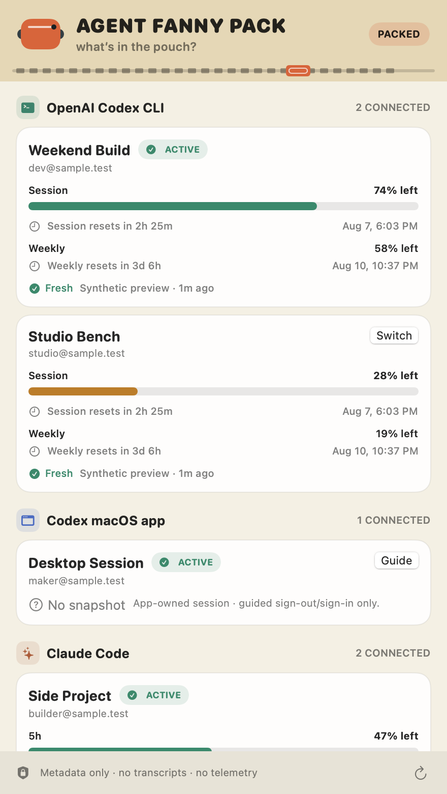

# Agent Fanny Pack

**Know which AI coding account is packed, how much first-party usage is left, and zip to the right profile without credential roulette.**

[](https://github.com/swordfish444/agent-fanny-pack/actions/workflows/ci.yml)
[](https://github.com/swordfish444/agent-fanny-pack/releases/latest)
[](LICENSE)



*The screenshot comes from the real built SwiftUI popover in synthetic preview mode. Every identity, quota value, reset time, and configuration path is fake.*

Developers who juggle a personal plan, a work seat, a research account, and one terminal too many know the problem: the CLI looks ready, but which account is it about to spend? Agent Fanny Pack is a focused macOS menu-bar utility for that moment. It groups accounts by tool surface, shows only authoritative quota snapshots, and makes switching an explicit, confirmed launcher choice.

No transcript warehouse. No mystery token math. Just the pouch.

## Install

```sh
brew install --formula swordfish444/tap/agent-fanny-pack
```

Then launch it with `agent-fanny-pack-ui`. Homebrew compiles the tagged public source inside its build sandbox and installs the resulting menu-bar app plus command-line helper. No downloaded app binary enters quarantine, and no Gatekeeper bypass is used. The prebuilt cask is disabled until a release can be Developer ID signed and notarized.

Requires macOS 13 or later. The release app is universal for Apple Silicon and Intel Macs.

## What is packed

- Provider-scoped active accounts: one Codex CLI profile and one Claude Code profile can both be active. They do not compete for a global crown.
- First-party quota bars, reset countdowns, absolute reset times, freshness, and explicit stale/offline/error states.
- Guarded switching through isolated provider configuration homes. Running sessions keep the credentials they started with.
- Native status item and popover only. No Dock app window in normal operation.
- Light and dark appearances, keyboard controls, VoiceOver labels, textual status alongside color, and reduced-motion support.
- Manual, coalesced refreshes; compact bounded storage; no daemon, analytics, telemetry, update ping, transcript scan, or LLM call.

## Provider support

| Tool surface | Identity and health | Authoritative quota | Multiple accounts | Switch behavior |
|---|---|---|---|---|
| OpenAI Codex CLI | Yes, via documented `account/read` | Yes, via documented `account/rateLimits/read` | Yes, isolated `CODEX_HOME` directories | Confirmed launcher-profile switch; existing sessions untouched |
| Codex macOS app | Guided, app-owned session only | Not claimed in v0.1 | No silent profile control | Opens a guided sign-out/sign-in flow; refresh remains unconfirmed without app-owned readback |
| Claude Code | Yes, via `claude auth status` | Yes, from documented status-line `rate_limits` fields | Yes, isolated `CLAUDE_CONFIG_DIR` directories | Confirmed launcher-profile switch; existing sessions untouched |
| Cursor | Deferred | Deferred | Deferred | No fabricated switch: Cursor documents login/logout/status, but not a safe personal quota plus isolated-profile contract |

The Codex adapter uses OpenAI's documented [app-server account and rate-limit API](https://learn.chatgpt.com/docs/app-server). Isolated homes follow OpenAI's documented [`CODEX_HOME` state model](https://learn.chatgpt.com/docs/config-file/config-advanced#config-and-state-locations). The Claude adapter follows Anthropic's documented [`CLAUDE_CONFIG_DIR`](https://code.claude.com/docs/en/env-vars), [machine-readable auth status](https://code.claude.com/docs/en/cli-usage), and [status-line rate-limit fields](https://code.claude.com/docs/en/statusline). Cursor remains deferred based on its current [CLI authentication contract](https://docs.cursor.com/en/cli/reference/authentication) and dashboard-only personal usage model.

## Pack an account

The menu-bar app discovers the default `~/.codex` and `~/.claude` homes. Add extra isolated profiles with the installed helper:

```sh
agent-fanny-pack profile add codex-cli \
  --id codex-weekend \
  --label "Weekend Build" \
  --home "$HOME/.codex-weekend"

CODEX_HOME="$HOME/.codex-weekend" codex login
```

```sh
agent-fanny-pack profile add claude-code \
  --id claude-lab \
  --label "Research Lab" \
  --home "$HOME/.claude-lab"

CLAUDE_CONFIG_DIR="$HOME/.claude-lab" claude auth login
```

Those login commands are the providers' own browser/OAuth flows. Agent Fanny Pack never receives a password and never copies an auth file. Run `agent-fanny-pack profile list` to inspect the non-secret profile registry.

### Connect Claude quota

Claude Code exposes subscription quota to local tools through its official status-line JSON after the first API response in a session. Point a profile's `statusLine` command at the bridge in that profile's `settings.json`:

```json
{
  "statusLine": {
    "type": "command",
    "command": "agent-fanny-pack ingest-claude-status --profile-id claude-lab"
  }
}
```

The bridge prints a compact `AFP · 5h … · 7d …` status line while saving only the two provider-supplied percentages and reset timestamps. It ignores transcript paths, context-window percentages, session token counts, and cost estimates. If you already use a custom status line, compose the bridge into that script rather than overwriting your existing command.

## Zip over safely

1. Open the pouch from the menu bar.
2. Choose **Switch** on an inactive Codex CLI or Claude Code profile.
3. Read the confirmation: only the Agent Fanny Pack launcher selection changes.
4. Start a new provider session through the helper:

```sh
agent-fanny-pack run codex
agent-fanny-pack run claude
```

An already-running terminal session is never logged out, killed, or reconfigured. For the Codex macOS app, **Guide** opens the app and leaves logout/login and final verification with the user. Agent Fanny Pack does not claim that switch succeeded.

## Privacy and security model

- Credentials stay in provider-owned homes, Keychain, or official OAuth storage.
- The app stores labels, non-secret identity, configuration-home pointers, active profile IDs, and quota snapshots only.
- Retention is capped at 32 profiles, eight snapshots per profile, and 128 snapshots total. State is written with owner-only file permissions.
- Errors are length-bounded and redact home paths, email addresses, authorization fields, and credential-shaped tokens before persistence or display.
- Codex refresh launches `codex app-server` only after a manual refresh and calls account/rate-limit methods; it never starts a model turn.
- Claude auth status and status-line ingestion are local. The app itself does not call Anthropic endpoints.
- There is no crash reporting, analytics, hidden telemetry, outbound sharing, transcript access, browser-cookie access, or self-update network request.

See [ARCHITECTURE.md](docs/ARCHITECTURE.md) for the full boundary.

## Performance model

Normal operation is event-light: one `NSStatusItem`, a SwiftUI popover created once, no polling timer, and no background daemon. Refreshes are user-triggered and coalesced. Claude quota ingestion is event-driven by Claude Code's own status-line lifecycle. Disk state is a small bounded JSON file; the app performs no repository or transcript indexing.

## Troubleshooting

**The app does not appear in the Dock.** Correct: it is a menu-bar utility (`LSUIElement`) by design. Look for the small pouch glyph in the menu bar.

**Codex says “No snapshot.”** Confirm the profile is signed in with its isolated `CODEX_HOME`, then press <kbd>⌘R</kbd> in the pouch. API-key-only or non-ChatGPT auth may not provide ChatGPT quota buckets.

**Claude is connected but has no quota.** Add the status-line bridge, start Claude Code with that profile, and complete one provider response. Anthropic documents that `rate_limits` can be absent before the first response or for unsupported account types.

**Switch did not change an existing shell.** That is intentional. The switch selects the profile for future `agent-fanny-pack run …` launches; existing processes keep their original environment.

**The source build fails.** Install the current Apple Command Line Tools from System Settings → General → Software Update, then retry the Homebrew command. The formula never downloads an executable app.

**Cursor says “Roadmap.”** Cursor is not connected. Agent Fanny Pack will not infer personal quota from local usage or pretend a documented logout/login command is a safe multi-profile contract.

Run `agent-fanny-pack doctor` for a concise provider-capability summary.

## Architecture

```text
Menu-bar popover
      │
      ├── bounded metadata store (no credentials)
      │
      ├── Codex CLI adapter ── isolated CODEX_HOME ── codex app-server
      │
      ├── Claude adapter ───── isolated CLAUDE_CONFIG_DIR
      │                         ├── claude auth status
      │                         └── status-line quota bridge
      │
      ├── Codex macOS guide (no credential control)
      └── Cursor unsupported adapter (fail closed)
```

Provider decoding, command construction, discovery, redaction, retention, and UI state are separate and deterministic. The application has no third-party Swift package dependency.

## Development

Requirements: macOS 13+, Swift 5.9+ and Apple Command Line Tools or Xcode.

```sh
git clone https://github.com/swordfish444/agent-fanny-pack.git
cd agent-fanny-pack

swift build --product AgentFannyPack
swift run AgentFannyPackTests
./scripts/public_safety_scan.sh
./scripts/package_app.sh 0.1.1 dist
```

The dependency-free test harness covers quota decoding, reset formatting, profile discovery, per-surface active state, guarded command construction, redaction, persistence bounds, error handling, and a real fake-executable/isolated-home process test. It exists because the minimal macOS Command Line Tools distribution does not always ship a test framework module.

Render the documentation screenshot without touching real accounts or the desktop:

```sh
swift run AgentFannyPack --render-screenshot docs/screenshot.png
```

The UI smoke command creates the real status item, opens the real popover with synthetic data, reads back both states, and exits:

```sh
swift run AgentFannyPack --ui-smoke-test
```

## Release and provenance

Public releases ship a deterministic tagged source archive beside a SHA-256 file. The Homebrew formula compiles that exact archive locally. [`scripts/package_source.sh`](scripts/package_source.sh) creates the source release; [`scripts/package_app.sh`](scripts/package_app.sh) still creates a universal test artifact for CI verification, but unsigned app archives are not distributed to users.

The icon and interface are original. The icon is generated from [`tools/IconMaker.swift`](tools/IconMaker.swift); UI glyphs are Apple SF Symbols; there are no downloaded visual assets. See [PROVENANCE.md](docs/PROVENANCE.md).

Developer ID signing and notarization are intentionally not faked. The prebuilt cask stays disabled until Apple-issued credentials can sign the exact built revision, submit it to Apple's notary service, staple the result, and pass a clean Gatekeeper test. The supported source-build formula requires none of those credentials and weakens no macOS security control.

## Roadmap

- Developer ID signing and notarization.
- In-popover profile creation using provider-owned login flows.
- A truthful Codex macOS account readback if OpenAI publishes a supported app integration contract.
- Cursor support only after a supported personal quota and isolated-account contract exists.
- Optional status-line composition helpers that preserve existing Claude setups.

## Contributing

Issues and focused pull requests are welcome. Keep integrations source-backed, provider-owned, and fail-closed. New providers need deterministic fixtures, fake-executable switching tests, explicit credential boundaries, offline/stale/error states, and public documentation for every capability claim.

Before opening a pull request:

```sh
swift run AgentFannyPackTests
./scripts/public_safety_scan.sh
```

Never commit real account data, screenshots, home paths, tokens, auth files, or provider cookies.

## License

MIT. See [LICENSE](LICENSE).
